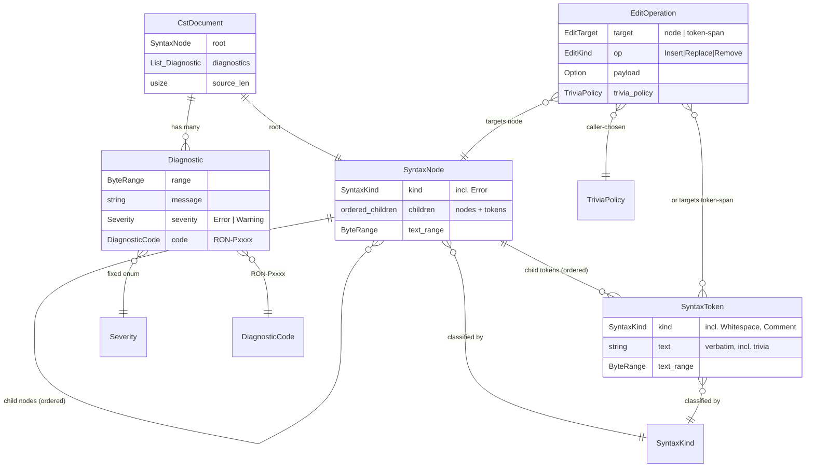

# Data Model: Lossless CST Core Engine (E001)

> Feature: 00001-lossless-cst-core-engine | Type: **in-memory domain model** | Source: spec.md (Key Entities, TR-001..TR-014)

**Scope note**: This document models the **in-memory** data structures of the `ron-core` crate. There is **no database, no SQL, no persistence layer, and no migrations** — entities are conceptual Rust types, not tables. Conceptual types are described independently of the underlying CST library (rowan); the public API MUST NOT leak rowan types (TR-009). "PK/FK/UNIQUE" terminology is intentionally absent; relationships are object references / tree edges, and constraints are runtime invariants.

## Entity Table

| Entity | Attributes (name: type, notes) | Relationships | Key Invariants / Validation |
|--------|--------------------------------|---------------|------------------------------|
| **CstDocument** | `root: SyntaxNode` (tree root); `diagnostics: List<Diagnostic>` (recovery findings, may be empty); `source_len: usize` (byte length of accepted input) | has-one root **SyntaxNode**; has-many **Diagnostic** | Round-trip identity: concatenation of all token texts under `root`, in order, equals the original source bytes exactly (TR-003, SC-003). `source_len` equals the summed byte width of all tokens. Holds for valid **and** error-recovered trees (TR-005). Constructed only from accepted UTF-8 input — non-UTF-8 is rejected at the API boundary before any `CstDocument` exists (TR-001). |
| **SyntaxNode** | `kind: SyntaxKind` (non-token classification, incl. `Error`); `children: ordered List<SyntaxElement>` (nodes and tokens interleaved in source order); `text_range: ByteRange` (absolute `[start, end)` byte offsets) | composite of child **SyntaxNode** + **SyntaxToken** (ordered); has-one parent **SyntaxNode** (root has none) | `text_range` is the union of all descendant token ranges (no gaps, no overlaps within the node). Child order is source order and is stable/deterministic (TR-012). An `Error` node wraps unexpected/unparseable tokens so the tree still covers all input (TR-005). Nesting depth is bounded (TR-014). |
| **SyntaxToken** | `kind: SyntaxKind` (token classification incl. trivia kinds); `text: string` (verbatim source slice, includes trivia bytes); `text_range: ByteRange` (absolute `[start, end)`) | leaf; has-one parent **SyntaxNode** | A token is a leaf (never has children). `text` is the **exact** source slice — never normalized, canonicalized, or re-escaped (TR-002). `text.len() == text_range.len()`. **Coverage invariant**: every source byte belongs to exactly one token (no byte un-tokenized, none double-counted) (SC-003). |
| **Trivia** | (a categorization of `SyntaxToken`, not a separate node type) `kind: SyntaxKind` ∈ {`Whitespace`, `Comment`}; `text: string` (verbatim, incl. BOM bytes and line endings) | attached to the tree as ordinary child tokens of a **SyntaxNode** under one fixed attachment rule (AD-001) | **AD-001 attachment rule**: leading trivia binds to the **following** significant token; trailing trivia at end-of-input binds to the nearest preceding structure. Exactly one attachment rule is applied consistently everywhere (risk mitigation: "inconsistent trivia model"). CRLF vs LF preserved exactly; a leading UTF-8 BOM is preserved as leading trivia (TR-001, edge cases). Trivia is semantically inert but MUST be preserved for losslessness. |
| **SyntaxKind** | `enum` value (closed set). RON-construct groups below | classifies every **SyntaxNode** and **SyntaxToken**; 1:N (one kind labels many elements) | Closed, deterministic enumeration; part of the stable surface as an opaque classification (no rowan raw-kind integers leaked, TR-009). MUST include `Error` for recovery (TR-005). Every node and token carries exactly one kind. |
| **Diagnostic** | `range: ByteRange` (precise source `[start, end)`, TR-006); `message: string` (human-readable); `severity: Severity` (fixed enum `Error` \| `Warning`, TR-013); `code: DiagnosticCode` (stable namespaced, e.g. `RON-Pxxxx`, TR-013) | belongs-to one **CstDocument**; conceptually points at a **ByteRange** within the source / `Error` region of the tree | One Diagnostic is emitted **per recovery point** (TR-013) — diagnostics are not duplicated for the same recovery event. `range` MUST be a valid sub-range of `[0, source_len)`. `severity` and `code` are part of the stable public API; codes come from a fixed registry. Diagnostics never alter the tree's byte coverage (presence of diagnostics does not change round-trip). |
| **EditOperation** | `target: EditTarget` (a `SyntaxNode` **or** a token-span `[SyntaxToken..SyntaxToken]`); `op: EditKind` (`Insert` \| `Replace` \| `Remove`); `payload: Option<replacement-text-or-subtree>` (absent for `Remove`); `trivia_policy: TriviaPolicy` (caller-chosen: keep/discard leading, keep/discard trailing) | applied to a **CstDocument** / a subtree of **SyntaxNode**; produces a new tree (edits are non-destructive transforms over an immutable tree) | Supports both node and token-span granularity (TR-011). **Losslessness preservation**: regions **not** touched by the edit MUST print byte-identically (SC-007); the whole tree remains printable after the edit. `trivia_policy` deterministically governs whether adjacent leading/trailing trivia is retained or dropped. No edit may leave the tree with un-covered or overlapping byte ranges. |

### SyntaxKind groupings (illustrative, closed set defined by the pinned `ron` grammar — TR-004)

| Group | Kinds (conceptual) |
|-------|--------------------|
| **Composite values** | `Struct`, `Tuple`, `List` (a.k.a. `Seq`), `Map`, `MapEntry`, `EnumVariant` |
| **Scalar literals** | `String`, `RawString`, `Char`, `Number`, `Bool`, `Unit` (`()`) |
| **Names / atoms** | `Ident` / `FieldName` |
| **RON extensions** | `ExtensionAttr` (e.g. `#![enable(implicit_some)]`, `unwrap_newtypes`, `unwrap_variant_newtypes`); unknown extension attrs preserved as text |
| **Trivia** | `Whitespace`, `Comment` |
| **Recovery** | `Error` |

> The authoritative kind set is whatever the **pinned `ron` crate version** accepts; that version is recorded in `plan.md` (TR-004). Option / `implicit_some` and non-string map keys are represented as distinct, preserved constructs (TR-004), not collapsed into other kinds.

## Cross-cutting Invariants (apply across all entities)

| ID | Invariant | Backing Requirement |
|----|-----------|---------------------|
| INV-1 | **Single-token byte coverage** — every source byte appears in exactly one `SyntaxToken`'s `text`. | TR-002, SC-003 |
| INV-2 | **Round-trip identity** — for an unmodified tree, concatenated token text == original source bytes, byte-for-byte. | TR-003, SC-001/002 |
| INV-3 | **Recovery completeness** — for malformed input, the tree (using `Error` nodes) still covers all input; INV-1/INV-2 still hold. | TR-005, SC-003/004 |
| INV-4 | **UTF-8 boundary** — non-UTF-8 input is rejected cleanly at the API boundary (never a panic) and is **never** represented in the tree; the tree models accepted UTF-8 only. | TR-001, SC-003 |
| INV-5 | **Bounded nesting** — recursion/nesting depth is bounded; exceeding the documented limit (default 128, configurable) emits a Diagnostic instead of overflowing the stack. The depth guard stops only *recursive descent*, not tokenization: bytes beyond the limit are still consumed into tokens (wrapped in `Error` nodes as needed), so INV-1 (single-token coverage), INV-2 (round-trip identity), and INV-3 (recovery completeness) continue to hold for depth-limited trees — a depth-limited tree still covers all input and round-trips byte-for-byte. | TR-014, SC-008 |
| INV-6 | **Determinism** — identical input yields an identical tree (same kinds, order, ranges) and identical diagnostics. | TR-012 |
| INV-7 | **Library-opaque surface** — no underlying CST-library (rowan) type appears in any entity's public shape; entities are swappable-by-construction. | TR-009, SC-006 |
| INV-8 | **Edit locality** — after any `EditOperation`, unaffected regions print byte-identically and the tree remains printable. | TR-011, SC-007 |
| INV-9 | **WASM-clean portability** — the `ron-core` crate (and the model's types) carry no filesystem/UI/async-runtime/native dependencies, so the model is constructible on `wasm32-unknown-unknown`; the wasm32 build gate is the proof. | TR-007, SC-005 |

## State / Lifecycle Notes

No persistent lifecycle (no stored records, no status workflow). The only conceptual transition is the in-memory transform pipeline, kept here because it is the model's sole "state change":

`source bytes → [accept UTF-8 boundary] → CstDocument (root + diagnostics) → [navigate / read diagnostics] → [EditOperation: produce new tree] → [print] → output bytes`

Edits are non-destructive: an `EditOperation` yields a new tree rather than mutating shared green nodes in place; the original `CstDocument` remains valid and round-trippable.

ER Diagram (visual reference — in-memory types, not tables)

---

## Data Model Summary (for plan.md)

| Entity | Key Fields | Relationships | Notes |
|--------|-----------|---------------|-------|
| CstDocument | root: SyntaxNode; diagnostics: List<Diagnostic>; source_len: usize | has-one SyntaxNode (root); has-many Diagnostic | Round-trip root: concatenated token text == source bytes; UTF-8-only; holds for error-recovered trees |
| SyntaxNode | kind: SyntaxKind; children: ordered nodes+tokens; text_range: ByteRange | composite of SyntaxNode + SyntaxToken; parent SyntaxNode | `Error` kind for recovery; deterministic source-order children; bounded depth |
| SyntaxToken | kind: SyntaxKind; text: string (verbatim); text_range: ByteRange | leaf; parent SyntaxNode | Carries trivia verbatim; every source byte in exactly one token |
| Trivia | kind ∈ {Whitespace, Comment}; text: string | child tokens under a SyntaxNode (AD-001) | Leading trivia binds to following significant token; BOM/CRLF preserved |
| SyntaxKind | closed enum (Struct, Tuple, List/Seq, Map, MapEntry, EnumVariant, String, RawString, Char, Number, Bool, Unit, Ident/FieldName, ExtensionAttr, Comment, Whitespace, Error) | classifies every node and token | Set defined by pinned `ron` grammar (TR-004); opaque (no rowan types leaked) |
| Diagnostic | range: ByteRange; message: string; severity: Error\|Warning; code: RON-Pxxxx | belongs-to CstDocument | Fixed severity enum + stable code registry; one per recovery point; part of stable API |
| EditOperation | target: node\|token-span; op: Insert\|Replace\|Remove; trivia_policy: keep/discard leading/trailing | applied to CstDocument / SyntaxNode subtree | Non-destructive transform; unaffected regions print byte-identically; tree stays printable |
