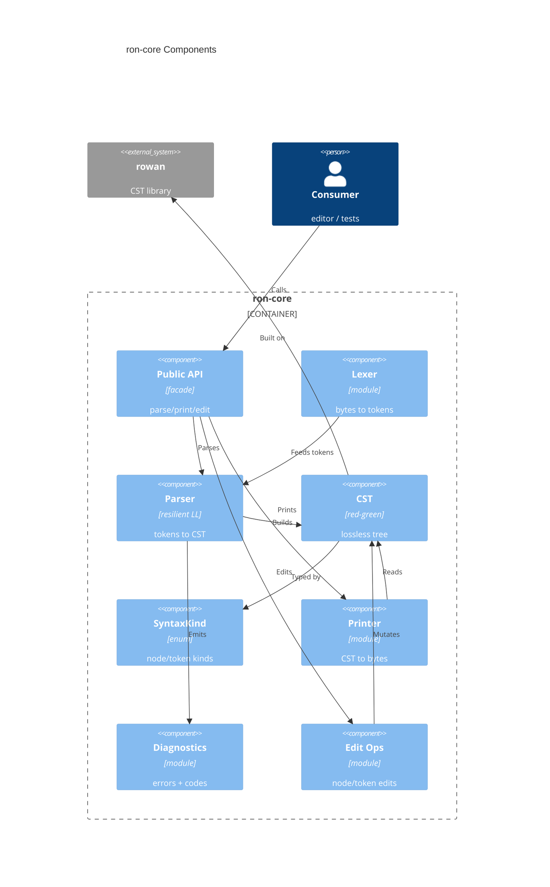

# Implementation Plan: Lossless CST Core Engine

**Branch**: `00001-lossless-cst-core-engine` | **Date**: 2026-06-11 | **Spec**: [spec.md](spec.md)

## Summary

**Goal**: Deliver `ron-core` — a Rust library that parses RON into a lossless, error-tolerant CST and re-prints it byte-for-byte — plus the Cargo workspace it lives in.
**Approach**: Hand-written resilient recursive-descent parser building a rowan red-green tree behind a rowan-free public API; verified by round-trip property/snapshot/corpus/fuzz tests and a wasm32 build gate.
**Key Constraint**: Byte-for-byte round-trip must hold for every accepted (UTF-8) input, including error-recovered trees; `ron-core` must stay WASM-clean.

## Technical Context

**Language/Version**: Rust 2021 edition, stable toolchain (≥ 1.77 per rowan MSRV)
**Primary Dependencies**: rowan 0.16.1 (CST). Dev/test: proptest 1.11.0, insta 1.47.2, cargo-fuzz 0.13.2 + arbitrary 1.4.2. (`ron = "=0.12.1"` is the grammar authority but NOT a `ron-core` dependency — reserved for E010 interop.)
**Storage**: N/A — in-memory only; filesystem I/O lives in the app (E003), not `ron-core`
**Testing**: cargo test + proptest (round-trip/idempotence) + insta (snapshots) + corpus + cargo-fuzz (no-panic)
**Target Platform**: Native Windows/macOS/Linux + `wasm32-unknown-unknown` (build gate)
**Project Type**: single (library workspace)
**Project Mode**: greenfield
**Performance Goals**: Correctness-only — no latency/throughput/memory threshold; guarantees are termination on any input and bounded nesting depth (no stack overflow). Benchmark harness established (TR-016), no pass/fail gate. Its sole purpose is to track/inform later interactive-performance epics (E003+); it carries NO release-gating role and MUST NOT be treated as a Definition-of-Done or QC criterion for E001. The project-wide Performance Standards (~16 ms frame budget, 100k-row tables) are desktop-editor targets owned by later epics, not this library epic.
**Constraints**: WASM-clean (no fs/net/thread/async/native deps); 0.x shape-stable API not leaking rowan types; UTF-8 input only (non-UTF-8 rejected cleanly, leading BOM preserved as trivia); all source under `/src`; no network/telemetry
**Scale/Scope**: Single-user library; scaling axis is file size; documented nesting-depth bound

## Instructions Check

*GATE: Must pass before Phase 0 research. Re-check after Phase 1 design.* — **PASS** (re-checked post-design)

| Principle / Rule | Gate | Status |
|------------------|------|--------|
| I. Never Corrupt User Data | Lossless round-trip invariant; edits preserve unaffected bytes | PASS (TR-002/003/011) |
| II. One Core, Many Surfaces | `ron-core` WASM-clean; no fs/UI/async/native deps; wasm32 build | PASS (TR-007, ADR-0002) |
| V. Verified Quality | proptest/insta/corpus/fuzz + clippy `-D warnings` + rustfmt + wasm32 gate | PASS |
| VI. Local-First & Private | No network/telemetry; user input parsed, not executed | PASS (N/A network) |
| Source Code Layout | Workspace crates under `/src` | PASS (TR-008) |
| ADR-0001 / ADR-0002 | Lossless CST as editing model; hexagonal WASM-clean core | PASS |

No violations — Complexity Tracking section omitted.

## Architecture



## Architecture Decisions

Feature-local tradeoffs only. Project-wide decisions live in standalone ADRs (referenced by ID).

| ID | Decision | Options Considered | Chosen | Rationale |
|----|----------|--------------------|--------|-----------|
| AD-001 | Trivia attachment model | attach-to-parent / attach-to-following-token / leading-binds-following | Leading trivia binds to the following significant token; trailing trivia at EOF binds to the last token | One consistent rule keeps round-trip and navigation predictable |
| AD-002 | Grammar/extension authority | latest ron / pinned ron / spec-only | Pin `ron = "=0.12.1"` as the authoritative surface; implement the equivalent grammar in `ron-core` | Spec clarification Q1; reproducible, concrete surface (ron not a core dep) |
| AD-003 | Diagnostic scheme | ad-hoc strings / numeric / namespaced registry | Namespaced `RON-Pxxxx` codes + severity enum (Error/Warning), one diagnostic per recovery point | Clarification Q3; stable public contract (TR-013) |
| AD-004 | Edit primitive granularity | node-only / token-span-only / both + trivia policy | Both node and token-span, with caller-chosen trivia policy (keep/discard leading/trailing) | Clarification Q5; serves E007/E008 contracts |
| AD-005 | Recursion/depth safety | unbounded recursion / explicit depth guard / iterative | Recursive descent with a configurable nesting-depth guard (default 128) that emits a diagnostic past the limit | Clarification Q6 / TR-014; prevents stack overflow within correctness-only envelope |
| AD-006 | Parser construction | parser generator / hand-written resilient LL | Hand-written resilient recursive-descent feeding rowan's GreenNodeBuilder | Full recovery control; matklad resilient-LL pattern |
| AD-007 | CST library | rowan / cstree / custom | rowan 0.16.1 (cstree 0.14.0 rejected: needs edition 2024 / Rust 1.85) | Implements ADR-0001 (rowan primary); pure-Rust, wasm-clean |
| AD-008 | Input encoding contract | arbitrary bytes / UTF-8 reject / UTF-8 wrap-error | UTF-8 only; non-UTF-8 rejected at the boundary (clean Err, no panic); leading BOM kept as trivia | Clarification Q8; matches rowan's `&str` model and the never-corrupt principle |

## Data Model Summary

| Entity | Key Fields | Relationships | Notes |
|--------|-----------|---------------|-------|
| CstDocument | root: SyntaxNode; diagnostics: List<Diagnostic>; source_len | has-one root SyntaxNode; has-many Diagnostic | Round-trip: concatenated token text == source bytes; UTF-8-only; holds for error-recovered trees |
| SyntaxNode | kind: SyntaxKind; children: ordered nodes+tokens; text_range | composite of nodes/tokens; parent SyntaxNode | `Error` kind for recovery; deterministic source-order children; bounded depth |
| SyntaxToken | kind: SyntaxKind; text (verbatim); text_range | leaf; parent SyntaxNode | Carries trivia verbatim; every source byte in exactly one token |
| Trivia | kind ∈ {Whitespace, Comment}; text | child tokens under a node (AD-001) | Leading trivia binds to following token; BOM/CRLF preserved |
| SyntaxKind | closed enum (Struct, Tuple, List/Seq, Map, MapEntry, EnumVariant, String, RawString, Char, Number, Bool, Unit, Ident, ExtensionAttr, Comment, Whitespace, Error) | classifies every node/token | Set defined by pinned ron 0.12.1 grammar (TR-004); opaque (no rowan types) |
| Diagnostic | range; message; severity: Error\|Warning; code: RON-Pxxxx | belongs-to CstDocument | Fixed severity enum + stable code registry; one per recovery point |
| EditOperation | target: node\|token-span; op: Insert\|Replace\|Remove; trivia_policy | applied to CstDocument subtree | Non-destructive; unaffected regions print byte-identically; tree stays printable |

**Detail**: [data-model.md](data-model.md)

## API Surface Summary

N/A — no network/RPC API surface. The public surface is the in-process `ron-core` Rust library API (parse → CST → diagnostics → print → edit), 0.x shape-stable and free of leaked rowan types (TR-009). It is described in Architecture and exercised via Integration Points.

## Testing Strategy

| Tier | Tool | Scope | Mock Boundary | Install |
|------|------|-------|---------------|---------|
| Unit | cargo test + proptest 1.11.0 | lexer/parser/printer/CST units; round-trip identity + idempotent print invariants | none (pure functions) | `cargo add --dev proptest`; cargo test built-in |
| Integration | insta 1.47.2 + corpus harness + cargo-fuzz 0.13.2 (+ arbitrary 1.4.2) | snapshot CST/print over a real serde+Bevy corpus; fuzz no-panic + round-trip on arbitrary input | filesystem read of corpus fixtures only | `cargo add --dev insta`; `cargo add --dev arbitrary --features derive`; `cargo install cargo-fuzz` |
| Security | cargo-audit 0.22.2 + cargo-deny 0.19.8 | dependency vulnerabilities; license/advisory/ban policy | — | `cargo install cargo-audit cargo-deny` |
| Coverage | cargo-llvm-cov 0.8.7 | line/region coverage (advisory; no enforced target per policy) | — | `cargo install cargo-llvm-cov` |

Mandatory gates (CI, owned by E002): `cargo fmt --check`, `cargo clippy -- -D warnings`, the test matrix, and `cargo build -p ron-core --target wasm32-unknown-unknown`.

Corpus floor (SC-001): ≥ 30 real RON files (≥ 1 per TR-004 construct group, ≥ 3 malformed, ≥ 1 file ≥ 1 MB). Fuzz acceptance (SC-003): a seeded `cargo-fuzz` run of ≥ 1,000,000 iterations (or a fixed CI time budget) finds zero panics; crash inputs are added to the seed corpus as regression cases.

### Verification Mechanism Map (TR → mechanism)

Every technical requirement traces to at least one verification mechanism (property = proptest, snapshot = insta, corpus = corpus harness, fuzz = cargo-fuzz, wasm = wasm32 build gate, consumer = downstream consumer crate, unit = cargo test).

| Req ID | Verification Mechanism(s) |
|--------|---------------------------|
| TR-001 | fuzz (no-panic on arbitrary/non-UTF-8), unit (UTF-8 boundary reject) |
| TR-002 | property (round-trip), snapshot, corpus |
| TR-003 | property (round-trip), snapshot, corpus, fuzz (round-trip oracle) |
| TR-004 | property (per-construct strategies), snapshot (per-literal-kind) |
| TR-005 | property/unit (ERROR-node coverage), fuzz (token-text == input) |
| TR-006 | unit/property over malformed-sample set (byte-range assertion) |
| TR-007 | wasm (wasm32 build gate) |
| TR-008 | unit (workspace `cargo build` of all crates) |
| TR-009 | consumer (consumer crate compiles using only public API, no rowan types) |
| TR-010 | unit (typed-accessor navigation tests) |
| TR-011 | property/unit (edit-locality: unaffected regions byte-identical) |
| TR-012 | property/unit (determinism: re-parse equality), snapshot stability |
| TR-013 | unit (severity enum + RON-Pxxxx code + one-per-recovery-point assertions) |
| TR-014 | unit (depth-limit diagnostic at bound+1, no overflow), fuzz (termination) |
| TR-015 | corpus (gap detection) feeding property strategies |
| TR-016 | benchmark harness runs over corpus (informational; no pass/fail assertion) |
| TR-017 | property (idempotent print: re-parse + re-print of printed output equals first print) |

## Error Handling Strategy

| Error Category | Pattern | Response | Retry |
|----------------|---------|----------|-------|
| Malformed RON (valid UTF-8) | error-tolerant recovery | ERROR node(s) in tree + Diagnostic (severity Error, RON-Pxxxx, byte range); parsing continues | no |
| Non-UTF-8 input | fail-fast at API boundary | clean `Err` (no tree, no panic) | no |
| Excessive nesting depth | bounded depth guard | stop descent; emit depth-limit Diagnostic; tree still round-trips | no |
| Unexpected internal state | defensive (never panic in release) | debug assertions in tests; release returns diagnostics/empty nodes | no |

## Integration Points

| Spec Reference | System/Service | Technical Approach | Contract |
|----------------|----------------|--------------------|----------|
| IP-001 | ronin-app editor (E003) | consumes parse/CST/print API to load, render, save | ron-core public API |
| IP-002 | validation (E006) | reads CST + diagnostics; type info supplied by ron-types | ron-core CST + Diagnostic API |
| IP-003 | persistence (E007) | uses CST + edit primitives for undo/redo | ron-core edit API (AD-004) |
| IP-004 | structural/table editing (E008) | uses transform/edit primitives | ron-core edit API (AD-004) |
| IP-005 | interop (E010) | CST drives conversion; serde `ron` only at the boundary | ron-core CST; `ron = "=0.12.1"` (E010 only) |

## Risk Mitigation

| Risk (from spec) | Likelihood | Impact | Mitigation | Owner |
|-------------------|------------|--------|------------|-------|
| Grammar completeness — a missing construct/extension breaks round-trip | M | H | proptest grammar strategies + cargo-fuzz + real-file corpus gate (SC-001/002/003); pin ron 0.12.1 as the surface authority; corpus-discovered constructs feed back into property strategies (TR-015) | ron-core |
| Inconsistent trivia model complicates losslessness/navigation | L | M | Fix one attachment rule (AD-001) up front; assert round-trip in every test | ron-core |
| Ambiguous literal forms (raw strings, numbers, non-string keys) | M | M | Targeted insta snapshot tests per literal kind; corpus coverage | ron-core |

## Requirement Coverage Map

| Req ID | Component(s) | File Path(s) | Notes |
|--------|--------------|--------------|-------|
| TR-001 | Public API, Lexer | src/ron-core/src/lib.rs, lexer.rs | UTF-8 validate + reject non-UTF-8; no panic |
| TR-002 | Lexer, CST | src/ron-core/src/lexer.rs, syntax/ | preserve all bytes incl. trivia |
| TR-003 | Printer | src/ron-core/src/printer.rs | re-print == input |
| TR-004 | Lexer, Parser, SyntaxKind | src/ron-core/src/{lexer,parser}.rs, syntax/kind.rs | full RON surface per pinned ron 0.12.1 |
| TR-005 | Parser, Diagnostics | src/ron-core/src/parser.rs, diagnostics.rs | ERROR nodes cover all input |
| TR-006 | Diagnostics | src/ron-core/src/diagnostics.rs | byte range per diagnostic |
| TR-007 | Crate config, CI | src/ron-core/Cargo.toml | no fs/UI/async/native; wasm32 build |
| TR-008 | Workspace | Cargo.toml, src/* | crates under /src |
| TR-009 | Public API facade | src/ron-core/src/lib.rs | 0.x stable; no rowan types leaked |
| TR-010 | Typed accessors | src/ron-core/src/syntax/ast.rs | typed CST navigation |
| TR-011 | Edit Ops | src/ron-core/src/edit.rs | node/token-span + trivia policy |
| TR-012 | Parser | src/ron-core/src/parser.rs | deterministic output |
| TR-013 | Diagnostics | src/ron-core/src/diagnostics.rs | severity enum + RON-Pxxxx, one/recovery point |
| TR-014 | Parser depth guard | src/ron-core/src/parser.rs | bounded nesting (default 128, configurable); no stack overflow; emits an over-limit Diagnostic (TR-013 contract) at the bound and still terminates with full byte coverage (INV-5/INV-3) |
| TR-015 | Corpus harness, proptest strategies | src/ron-core/tests/corpus.rs, roundtrip.rs | corpus-discovered constructs feed back into property strategies |
| TR-016 | Benchmark harness | src/ron-core/benches/ | parse/print over corpus; informs later epics; no pass/fail gate (not a QC/release criterion) |
| TR-017 | Printer | src/ron-core/src/printer.rs | idempotent print (print∘parse stable); asserted via proptest |

## Project Structure

### Source Code

```text
Cargo.toml                        # workspace root (members under src/)
rust-toolchain.toml               # pin stable >= 1.77
deny.toml                         # cargo-deny policy
src/
  ron-core/
    Cargo.toml
    src/
      lib.rs                      # public API facade (no rowan types leaked)
      lexer.rs                    # bytes -> tokens; UTF-8 boundary check
      parser.rs                   # resilient LL -> GreenNodeBuilder; depth guard
      printer.rs                  # CST -> bytes (round-trip)
      diagnostics.rs              # Diagnostic, severity, RON-Pxxxx codes
      edit.rs                     # node/token-span edit primitives
      syntax/
        mod.rs
        kind.rs                   # SyntaxKind enum (incl. ERROR)
        ast.rs                    # typed accessors over the CST
    tests/
      roundtrip.rs                # proptest round-trip / idempotence
      snapshots.rs                # insta snapshots
      corpus.rs                   # real serde + Bevy corpus round-trip
      consumer_api.rs             # public-API consumer test (no leaked types)
      corpus/                     # fixture .ron / .scn.ron files
    benches/
      parse_print.rs              # benchmark harness (informational, no gate)
    fuzz/
      Cargo.toml
      fuzz_targets/roundtrip.rs   # cargo-fuzz no-panic + round-trip
  ron-types/                      # stub crate (full impl: E004)
    Cargo.toml
    src/lib.rs
  ronin-app/                      # stub crate (full impl: E003)
    Cargo.toml
    src/main.rs
```

Note: `ron-types` and `ronin-app` are minimal stubs in E001 so the workspace builds; the reserved `ron-lsp` crate is not yet created.

## Implementation Hints

- **[HINT-001]** Order: Lock the AD-001 trivia rule before writing the parser — round-trip tests depend on consistent trivia placement.
- **[HINT-002]** Gotcha: Validate UTF-8 at the API boundary and reject non-UTF-8 before lexing (TR-001/AD-008); rowan operates on `&str`.
- **[HINT-003]** Constraint: Keep `ron-core` deps pure-Rust (rowan only) and wire the `wasm32-unknown-unknown` build into CI from day one (ADR-0002/TR-007).
- **[HINT-004]** Gotcha: Every parser loop iteration must consume ≥1 token (resilient-LL invariant) to guarantee termination (TR-014); pair with the depth guard.
- **[HINT-005]** Constraint: Do not expose rowan types in the public API (TR-009); wrap SyntaxNode/SyntaxKind behind `ron-core` newtypes so cstree stays swappable.
